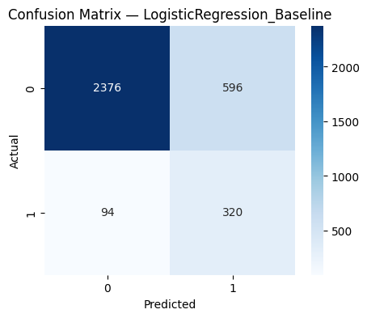
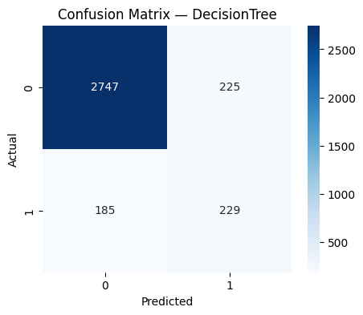
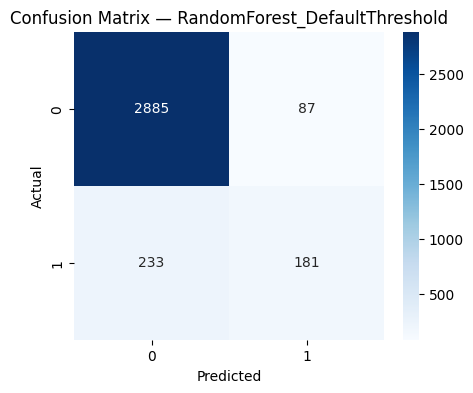
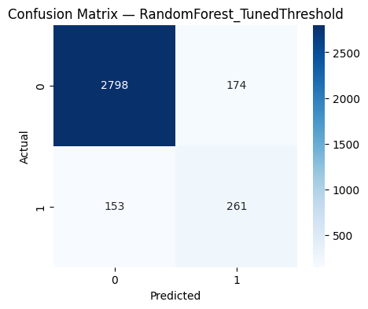

# 🎮 Video Game Hit Prediction

> Binary classification model predicting whether a video game will become a commercial hit — defined as achieving over 1 million units in global sales.

   

---

## Overview

The video game industry generates billions of dollars annually, yet predicting commercial success remains a challenge. This project frames the problem as a **supervised binary classification task**: given pre-release and early post-release features of a game (platform, genre, publisher, critic/user scores), can we predict whether it will be a hit?

We trained and compared four machine learning models, tracked experiments with MLflow, and achieved **91% accuracy** with a tuned Random Forest classifier.

---

## Dataset

- **Source:** [Video Game Sales Dataset — Kaggle](https://www.kaggle.com/datasets/gregorut/videogamesales)
- **Size:** 16,928 records, 17 features
- **Target:** Binary — `Hit` (global sales > 1M units) / `Not Hit`
- **Key features used:** Platform, Genre, Publisher, Rating, Critic Score, User Score, Critic Count, User Count, Year of Release

> Sales-related columns (NA_Sales, EU_Sales, etc.) were dropped to prevent data leakage.

---

## Methodology

### Data Preprocessing
- Converted `User_Score` from object to numeric type
- Imputed missing values (median for numerical, most frequent for categorical)
- Applied `StandardScaler` for numerical features
- One-hot encoded categorical features
- 80/20 stratified train-test split

### Models Trained

| Model | Accuracy | Notes |
|---|---|---|
| Logistic Regression | ~80% | Baseline; high recall, low precision |
| LinearSVC | ~79% | Similar behavior to Logistic Regression |
| Decision Tree | ~88% | Better precision, captures non-linear patterns |
| Random Forest (default) | ~91% | Best accuracy; conservative on Hit class |
| **Random Forest (tuned threshold)** | **~91%** | **Best F1; improved Hit recall** |

### Experiment Tracking
All experiments were logged with **MLflow**, tracking model parameters, evaluation metrics, confusion matrix artifacts, and trained pipelines for full reproducibility.

---

## Results

The **Random Forest with a tuned classification threshold** achieved the best overall performance. Lowering the decision threshold from 0.5 improved recall for the Hit class — meaning more actual hit games were correctly identified — at the cost of a small increase in false positives. Given the class imbalance in the dataset, **F1-score** was used as the primary evaluation metric rather than accuracy alone.

### Confusion Matrices

<table>
  <tr>
    <td><br><sub>Logistic Regression</sub></td>
    <td><br><sub>Decision Tree</sub></td>
  </tr>
  <tr>
    <td><br><sub>Random Forest (Default)</sub></td>
    <td><br><sub>Random Forest (Tuned) ✅</sub></td>
  </tr>
</table>

---

## Project Structure

```
video-game-hit-prediction/
├── artifacts/                          # Confusion matrix plots
│   ├── DecisionTree_cm.png
│   ├── LinearSVM_cm.png
│   ├── LogisticRegression_Baseline_cm.png
│   ├── RandomForest_DefaultThreshold_cm.png
│   └── RandomForest_TunedThreshold_cm.png
├── Video_Games.csv                     # Dataset
├── video_games.ipynb                   # Full notebook: EDA, modeling, evaluation
├── report.docx                         # Course project report
├── .gitignore
├── LICENSE
└── README.md
```

---

## Tech Stack

- **Language:** Python 3.x
- **ML:** scikit-learn
- **Data:** pandas, numpy
- **Visualization:** matplotlib, seaborn
- **Experiment Tracking:** MLflow

---

## Team

**CSCI4734 – Machine Learning | Fall 2025 | ADA University**

- Maisa Babayeva
- Shabnam Shirinova
- Vasif Maharramli
